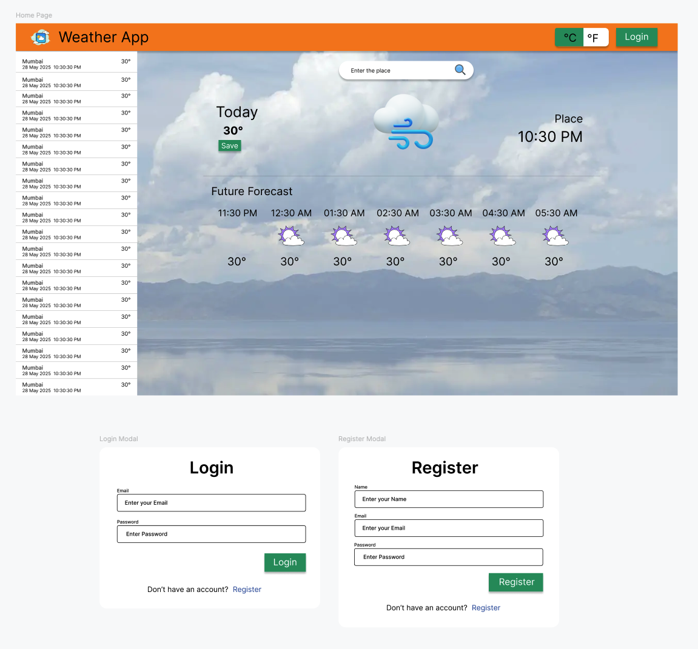

# Weather App

A weather app that lets users search for real-time forecasts in any location. With secure login, users can save favorite places, access past weather data, and receive personalized forecasts. All data is safely stored for easy retrieval across devices.

### [Live Demo](https://qodex-ai-assignment.pages.dev/)
### [Demo Video](https://drive.google.com/file/d/1doTj4OjRzWRJjYgl-miOJ8GK9y_VOiGn/view?usp=sharing)

## Features
1. Search for a city and display current weather details.
2. Show temperature, humidity, wind speed, and weather conditions (sunny, rainy, etc.).
3. Display an appropriate weather icon using an external API.
4. Used OpenWeatherMap API (https://openweathermap.org/api).
5. Implemented API polling every 30 seconds to update the weather data.
6. Handle API errors gracefully (e.g., incorrect city name, network failure, etc.).
7. Saves the last searched city and load its weather data when the user revisits the app.
8. A separate component for search input.
9. A separate component for displaying weather information.
10. Added Alert component to show error and success status.
11. Used useReducer and useContext hooks managing the global state.
12. Implemented a 5-day weather forecast using an API endpoint.
13. Added a switch to toggle between Celsius and Fahrenheit.
14. Used React Query to fetch and cache API data.
15. Use supabase to login and save data.

## Figma Design


## Running locally

Environment variables required

```
VITE_OPENWEATERMAP_API_KEY=secretkey //get it from https://openweathermap.org/api
VITE_DB_URL=secret // get it from Supabase
VITE_DB_ANON_KEY=secret // get if from Supabase
```

1. clone the repo and install pacakges by running `pnpm install`
2. Run dev server using `pnpm dev`
3. To build project run `pnpm build`
4. To preview production build run `pnpm preview`